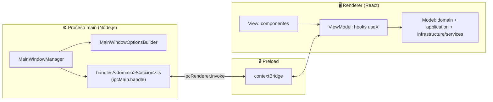

<div align="center">

# 🥷 Hachikage

### Automatiza tu control de versiones con IA local, desde un chat

*Electron · React · TypeScript · Tailwind*

</div>

---

## 📖 ¿Qué es Hachikage?

**Hachikage** es una aplicación de escritorio que **automatiza el control de versiones** (Git/GitHub) de tus proyectos, presentes y futuros, a través de una interfaz de **chat conversacional**.

En lugar de escribir a mano `git rebase`, `git push`, crear un Pull Request o resolver conflictos, simplemente le dices a Hachikage qué quieres lograr y ella lo traduce en las operaciones reales sobre tu repositorio. 🚀

> 💬 *"Crea un PR de mi rama `feature/login` hacia `main`, con descripción automática de los commits."*

---

## 🎯 Motivo de desarrollo

> ✨ *"Mi motivo de desarrollar es automatizar el control de versiones para los proyectos en desarrollo, y en el futuro."*
> — Edahi98

El corazón de Hachikage es su **enrutador de modelos de IA** 🧠🔀🔒: un **clasificador basado en transformers** analiza la intención de cada mensaje del chat y decide a cuál **modelo** enviarlo — el clasificador y los modelos son dos componentes distintos. Ambos se ejecutan 100% en local mediante [Ollama](https://ollama.com/).

No hay llamadas a APIs de IA en la nube ni proveedores externos: el clasificador **enruta dinámicamente** cada mensaje hacia el modelo local (servido por Ollama) más adecuado para la tarea — entender la intención del usuario, planear los comandos de Git/GitHub necesarios, redactar descripciones de PR, resolver conflictos, etc. Todo corre en la máquina del usuario.

Esto habilita:

- 🧩 **Elegir el modelo local óptimo por tarea** — el clasificador transformer distingue entre razonamiento, generación de texto o clasificación de intención, y enruta cada una a un modelo de Ollama distinto en lugar de forzar todo al mismo.
- 🔌 **Cambiar de modelo local sin fricción** — descargar o sustituir uno de los modelos servidos por Ollama no implica reescribir ni el clasificador ni la lógica de negocio de la app.
- 🔒 **Privacidad y funcionamiento sin conexión** — al correr todo en local, el código, los commits y los mensajes del chat nunca salen de la máquina del usuario hacia un tercero.
- 📈 **Crecer sin límite** — pensada desde el día uno como una aplicación **grande en funciones**, no un prototipo desechable; el flujo de automatización de Git nunca queda acoplado a un modelo de Ollama específico.

---

## 🧱 Stack

| Tecnología | Uso |
|---|---|
| 🦙 [**Ollama**](https://ollama.com/) | Motor de IA — ejecuta en local (sin nube ni proveedores externos) tanto el clasificador transformer del router como los modelos a los que enruta |
| ⚡ [**Electron Forge**](https://www.electronforge.io/) | Empaquetado y orquestación del build ([`forge.config.ts`](forge.config.ts)) |
| 📦 **Webpack** | Bundlea main, preload y renderer por separado ([`webpack.main.config.ts`](webpack.main.config.ts), [`webpack.renderer.config.ts`](webpack.renderer.config.ts)) |
| 🟦 **TypeScript** `^5.9` | Tipado estático; chequeo vía `npm run typecheck` |
| ⚛️ **React 19** + **react-router-dom 7** | UI del renderer, con `HashRouter` |
| 🎨 **Tailwind CSS v4** | Estilos utilitarios vía `@tailwindcss/postcss` |
| 🧊 **Font Awesome** | Iconografía (`free-solid`/`free-regular`/`free-brands`) |
| 🧹 **ESLint 8** | Calidad de código (`@typescript-eslint`, React, hooks) |

---

## 🏗️ Arquitectura

Electron obliga a separar el código en **tres procesos con responsabilidades distintas**, y cada uno se compila como un bundle de Webpack independiente desde una única declaración de entry points en [`forge.config.ts`](forge.config.ts):



### ⚙️ Proceso main (Node.js)

Todo lo que toca APIs nativas de Electron o del sistema operativo vive aquí:

- 🪟 [`src/index.ts`](src/index.ts) es el punto de entrada: arranca la app y **delega** (no implementa) la creación de la ventana a la clase `MainWindowManager` (`src/main/window/MainWindowManager.ts`).
- 🧰 Las opciones de la ventana (tamaño, preload, barra de título) se arman con el patrón **Builder** — `MainWindowOptionsBuilder` (`src/main/window/MainWindowOptionsBuilder.ts`) — en vez de un objeto de configuración gigante armado a mano. Esto es lo que hoy define, por ejemplo, la barra de título nativa oscura y personalizada (sin el menú `File/Edit/View/Window` por defecto) a juego con el tema visual de la app.
- 🔁 **Toda** comunicación proceso-a-proceso sigue el patrón IPC *"Renderer → main (two-way)"* de Electron — nunca el patrón unidireccional `send`/`on`:
  ```
  handles/
    <dominio>/          ← p. ej. "git", "github", "ai-router"
      create.ts          ← cada archivo registra UNA sola acción
      read.ts             (ipcMain.handle('<canal>', ...))
      update.ts
      delete.ts
  ```
  Cada handler recibe la llamada, pero **delega el trabajo real** a clases de `application`/`domain`/`services` — el archivo del handler solo conecta el canal IPC con esa lógica.
- 📡 El [preload](src/preload.ts) expone esos canales al renderer vía `contextBridge`, y el renderer los consume con `ipcRenderer.invoke(canal, payload)`.
- 🧱 Fuera de los propios callbacks de `ipcMain.handle` (que deben seguir siendo funciones, es un requisito de la API de Electron), **todo se encapsula en clases** — nunca funciones sueltas exportadas.

### 🖥️ Renderer (frontend)

El renderer combina **tres enfoques complementarios** aplicados a cada *feature* (p. ej. `chat`, y en el futuro `git`, `github`, `ai-router`...):

| Enfoque | Qué resuelve | Capas |
|---|---|---|
| 🧬 **Atomic Design** | Granularidad y reutilización visual de componentes | `atoms/` → `molecules/` → `organisms/` → `templates/` → páginas |
| ⬡ **Arquitectura Hexagonal** | Aislar reglas de negocio de la infraestructura (HTTP, IA, storage) | `domain/` (entidades + puertos) · `application/` (casos de uso) · `infrastructure/` (adaptadores, con `services/` para llamadas HTTP/IA) |
| 🔄 **MVVM** | Que los componentes no sepan nada de lógica ni de datos | *View* → *ViewModel* → *Model* |

**Mapeo MVVM concreto:**

- **View** — los componentes (`ui/atoms`, `ui/molecules`, `ui/organisms`, `ui/templates`, páginas). Reciben props y renderizan; cero lógica de negocio, cero llamadas HTTP. Ejemplo real: [`ChatMessageBubble.tsx`](src/features/chat/ui/molecules/ChatMessageBubble.tsx), [`ChatInputBar.tsx`](src/features/chat/ui/organisms/ChatInputBar.tsx).
- **ViewModel** — los hooks (`useX`, en `application/` o `shared/`). Guardan el estado de la UI, llaman casos de uso/servicios y exponen datos + handlers a la View. Es la única puerta de entrada de un componente hacia la lógica.
- **Model** — entidades de `domain/`, casos de uso de `application/` y adaptadores de `infrastructure/services/` (donde vivirá, por ejemplo, la llamada real a la API local de Ollama para el enrutador de modelos de IA).

**Reglas estructurales que se respetan en todo el frontend** (detalladas en [`CLAUDE.md`](CLAUDE.md)):

- 📄 **Un componente y una clase por archivo** — nunca varias declaraciones en el mismo archivo.
- 🧱 **Sin funciones sueltas** — todo caso de uso/servicio/lógica de dominio es una clase, salvo los propios componentes (function components) y los hooks (deben seguir las Rules of Hooks de React).
- 🔗 **Tipos centralizados** — toda `interface`/`type` vive en `shared/types/`, nunca declarada dentro de una feature.
- 🧰 **Builder para objetos complejos** — entidades, payloads o configuraciones se arman con builders, no con constructores gigantes.
- ♻️ **DRY + SOLID** — cualquier pieza usada por más de una feature migra a `shared/`, replicando las mismas capas de Atomic Design.

Ejemplo real de esta estructura, la feature `chat` ya implementada:

```
src/
├─ shared/
│  ├─ types/chat.ts                        ← ChatMessage, ChatConversationSummary
│  └─ ui/
│     ├─ organisms/  Navbar.tsx  Sidebar.tsx
│     └─ templates/  AppLayout.tsx
└─ features/
   └─ chat/
      └─ ui/
         ├─ atoms/      ChatSendButton.tsx
         ├─ molecules/  ChatMessageBubble.tsx
         ├─ organisms/  ChatMessageList.tsx  ChatInputBar.tsx
         └─ pages/      ChatPage.tsx
```

`Navbar` y `Sidebar` viven en `shared/` porque son parte del layout global de la app (usado por cualquier página futura), mientras que las burbujas de mensaje y la barra de input son específicas de la feature `chat`.

---

## 🛠️ Comandos

| Comando | Descripción |
|---|---|
| `npm start` | 🔥 Modo desarrollo (hot reload) |
| `npm run lint` | 🧹 Lint de `.ts`/`.tsx` |
| `npm run typecheck` | ✅ Chequeo de tipos sin emitir |
| `npm run package` | 📦 Build sin instaladores |
| `npm run make` | 💿 Build de instaladores/distribuibles |
| `npm run publish` | 🚀 Publica vía los publishers de Electron Forge |

> ⚠️ No hay test runner configurado. Todo cambio debe verificarse compilando: `npm run typecheck` y `npm run lint`.

---

<div align="center">

Hecho con 💜 para automatizar tu flujo de Git & GitHub

</div>
